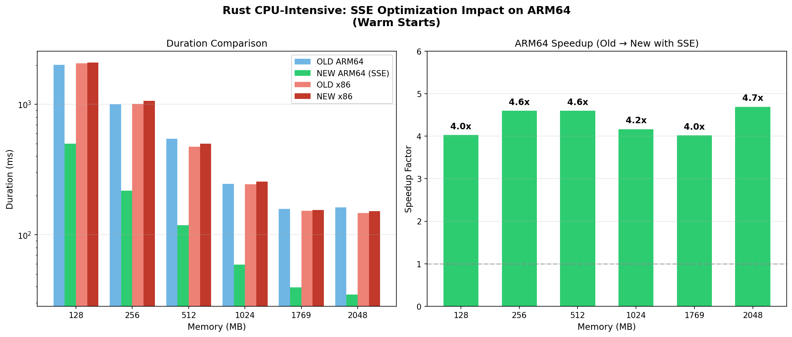

# Benchmark Results - December 2025

## Test Run Information

- **Test Run ID**: `ab3aaaf8-6aa8-4b26-9561-ec2ed16c5b0a`
- **Date**: November 30, 2025 (12:54 UTC)
- **Mode**: Balanced
- **Region**: us-east-2
- **Execution**: EC2 instance (`i-0e1e515139a482979`) with IAM instance profile
- **Total Configurations**: 294
- **Total Invocations**: 94,080
- **Cold Starts per Config**: 20
- **Warm Starts per Config**: 300

### Orchestrator Improvements

This run includes improvements to the benchmark orchestrator:
- Fixed `ResourceConflictException` handling with retry logic and exponential backoff (1, 2, 4, 8, 16 seconds)
- Added waiter after final memory update (was previously missing)
- Result: 0 failed invocations out of 94,080 (previous run failed 148/294 configs)

### Changes from November 2025 Run

This run uses reduced sampling compared to the November 2025 production run:

| Parameter | November 2025 | December 2025 |
|-----------|---------------|---------------|
| Cold starts per config | 125 | 20 |
| Warm starts per config | 500 | 300 |
| Total invocations | 183,750 | 94,080 |

**Rationale**: Cold start measurements showed consistent results across all runtimes in November, so we reduced cold start sampling to focus on warm start performance. The reduced warm start count still provides statistically significant results while completing faster.

### Rust ARM64 Performance Improvement

This run includes a significant optimization to the Rust CPU-intensive workload. Thanks to [Khawaja Shams](https://github.com/khawajashams) for the excellent suggestion to enable assembly-optimized SHA-256 hashing.

**Commit**: [`fb6a2a9`](https://github.com/cebert/aws-lambda-performance-benchmarks/commit/fb6a2a948a3461e3ccee80f06adb7a99b228d58c) - `perf(rust): optimize SHA-256 hashing in cpu-intensive workload`

**Changes made:**
1. **Enabled `asm` feature on `sha2` crate** - This enables assembly-optimized SHA-256 implementations that leverage CPU-specific SIMD instructions (NEON on ARM64, SSE/AVX on x86)
   ```toml
   sha2 = { version = "0.10", features = ["asm"] }
   ```
2. **Reuse hasher via `finalize_reset()`** - Instead of allocating a new `Sha256` hasher each iteration, reuse and reset
3. **Use fixed-size `[u8; 32]` array** - Instead of `Vec` allocation each iteration, use a stack-allocated fixed-size array

**Results**: Rust ARM64 CPU-intensive performance improved by **4-5x** across all memory configurations:

| Memory (MB) | Old ARM64 (ms) | New ARM64 (ms) | Speedup |
|------------:|---------------:|---------------:|--------:|
| 128 | 2,016 | 501 | 4.0x |
| 256 | 1,003 | 217 | 4.6x |
| 512 | 538 | 119 | 4.5x |
| 1024 | 268 | 59 | 4.5x |
| 1769 | 159 | 39 | 4.1x |
| 2048 | 158 | 35 | 4.5x |

This optimization enables Rust to leverage SIMD instructions (NEON on ARM64) for SHA-256 hashing, bringing ARM64 performance in line with expectations for compute-heavy workloads.



### Test Matrix

- **Runtimes**: nodejs20, nodejs22, python3.11, python3.12, python3.13, python3.14, rust
- **Architectures**: arm64, x86
- **Workload Types**: cpu-intensive, light, memory-intensive
- **Total Configurations**: 42

<details>
<summary>Click to view full configuration matrix</summary>

    | Runtime | Architecture | Workload | Memory Sizes (MB) |
    |---------|--------------|----------|-------------------|
    | nodejs20 | arm64 | cpu-intensive | 128, 256, 512, 1024, 1769, 2048 |
    | nodejs20 | arm64 | light | 128, 256, 512, 1024, 1769, 2048 |
    | nodejs20 | arm64 | memory-intensive | 128, 256, 512, 1024, 1769, 2048, 4096, 8192, 10240 |
    | nodejs20 | x86 | cpu-intensive | 128, 256, 512, 1024, 1769, 2048 |
    | nodejs20 | x86 | light | 128, 256, 512, 1024, 1769, 2048 |
    | nodejs20 | x86 | memory-intensive | 128, 256, 512, 1024, 1769, 2048, 4096, 8192, 10240 |
    | nodejs22 | arm64 | cpu-intensive | 128, 256, 512, 1024, 1769, 2048 |
    | nodejs22 | arm64 | light | 128, 256, 512, 1024, 1769, 2048 |
    | nodejs22 | arm64 | memory-intensive | 128, 256, 512, 1024, 1769, 2048, 4096, 8192, 10240 |
    | nodejs22 | x86 | cpu-intensive | 128, 256, 512, 1024, 1769, 2048 |
    | nodejs22 | x86 | light | 128, 256, 512, 1024, 1769, 2048 |
    | nodejs22 | x86 | memory-intensive | 128, 256, 512, 1024, 1769, 2048, 4096, 8192, 10240 |
    | python3.11 | arm64 | cpu-intensive | 128, 256, 512, 1024, 1769, 2048 |
    | python3.11 | arm64 | light | 128, 256, 512, 1024, 1769, 2048 |
    | python3.11 | arm64 | memory-intensive | 128, 256, 512, 1024, 1769, 2048, 4096, 8192, 10240 |
    | python3.11 | x86 | cpu-intensive | 128, 256, 512, 1024, 1769, 2048 |
    | python3.11 | x86 | light | 128, 256, 512, 1024, 1769, 2048 |
    | python3.11 | x86 | memory-intensive | 128, 256, 512, 1024, 1769, 2048, 4096, 8192, 10240 |
    | python3.12 | arm64 | cpu-intensive | 128, 256, 512, 1024, 1769, 2048 |
    | python3.12 | arm64 | light | 128, 256, 512, 1024, 1769, 2048 |
    | python3.12 | arm64 | memory-intensive | 128, 256, 512, 1024, 1769, 2048, 4096, 8192, 10240 |
    | python3.12 | x86 | cpu-intensive | 128, 256, 512, 1024, 1769, 2048 |
    | python3.12 | x86 | light | 128, 256, 512, 1024, 1769, 2048 |
    | python3.12 | x86 | memory-intensive | 128, 256, 512, 1024, 1769, 2048, 4096, 8192, 10240 |
    | python3.13 | arm64 | cpu-intensive | 128, 256, 512, 1024, 1769, 2048 |
    | python3.13 | arm64 | light | 128, 256, 512, 1024, 1769, 2048 |
    | python3.13 | arm64 | memory-intensive | 128, 256, 512, 1024, 1769, 2048, 4096, 8192, 10240 |
    | python3.13 | x86 | cpu-intensive | 128, 256, 512, 1024, 1769, 2048 |
    | python3.13 | x86 | light | 128, 256, 512, 1024, 1769, 2048 |
    | python3.13 | x86 | memory-intensive | 128, 256, 512, 1024, 1769, 2048, 4096, 8192, 10240 |
    | python3.14 | arm64 | cpu-intensive | 128, 256, 512, 1024, 1769, 2048 |
    | python3.14 | arm64 | light | 128, 256, 512, 1024, 1769, 2048 |
    | python3.14 | arm64 | memory-intensive | 128, 256, 512, 1024, 1769, 2048, 4096, 8192, 10240 |
    | python3.14 | x86 | cpu-intensive | 128, 256, 512, 1024, 1769, 2048 |
    | python3.14 | x86 | light | 128, 256, 512, 1024, 1769, 2048 |
    | python3.14 | x86 | memory-intensive | 128, 256, 512, 1024, 1769, 2048, 4096, 8192, 10240 |
    | rust | arm64 | cpu-intensive | 128, 256, 512, 1024, 1769, 2048 |
    | rust | arm64 | light | 128, 256, 512, 1024, 1769, 2048 |
    | rust | arm64 | memory-intensive | 128, 256, 512, 1024, 1769, 2048, 4096, 8192, 10240 |
    | rust | x86 | cpu-intensive | 128, 256, 512, 1024, 1769, 2048 |
    | rust | x86 | light | 128, 256, 512, 1024, 1769, 2048 |
    | rust | x86 | memory-intensive | 128, 256, 512, 1024, 1769, 2048, 4096, 8192, 10240 |

</details>

## Summary Statistics

- **Total Aggregates**: 588
- **Runtimes Tested**: nodejs22, nodejs20, python3.14, python3.13, python3.12, python3.11, rust
- **Workload Types**: cpu-intensive, light, memory-intensive
- **Architectures**: arm64, x86

## Contents

### Comparison Tables

- [CPU Intensive Workload](tables/cpu-intensive/)
  - [Cold Starts](tables/cpu-intensive/cold.md)
  - [Warm Starts](tables/cpu-intensive/warm.md)
- [Light Workload](tables/light/)
  - [Cold Starts](tables/light/cold.md)
  - [Warm Starts](tables/light/warm.md)
- [Memory Intensive Workload](tables/memory-intensive/)
  - [Cold Starts](tables/memory-intensive/cold.md)
  - [Warm Starts](tables/memory-intensive/warm.md)

### Charts

- [CPU Intensive Workload](charts/cpu-intensive/)
  - Memory Scaling (cold & warm)
  - P99 Duration Scaling (cold & warm)
  - Cost Effectiveness (cold & warm)
  - Runtime Family P99 Comparison (warm)
- [Light Workload](charts/light/)
  - Memory Scaling (cold & warm)
  - P99 Duration Scaling (cold & warm)
  - Cost Effectiveness (cold & warm)
  - Runtime Family P99 Comparison (warm)
- [Memory Intensive Workload](charts/memory-intensive/)
  - Memory Scaling (cold & warm)
  - P99 Duration Scaling (cold & warm)
  - Cost Effectiveness (cold & warm)
  - Runtime Family P99 Comparison (warm)
- [Cold Start Analysis](charts/cold-start-analysis.png)
- [Rust SSE Optimization Comparison](charts/rust-sse-optimization-comparison.png)
